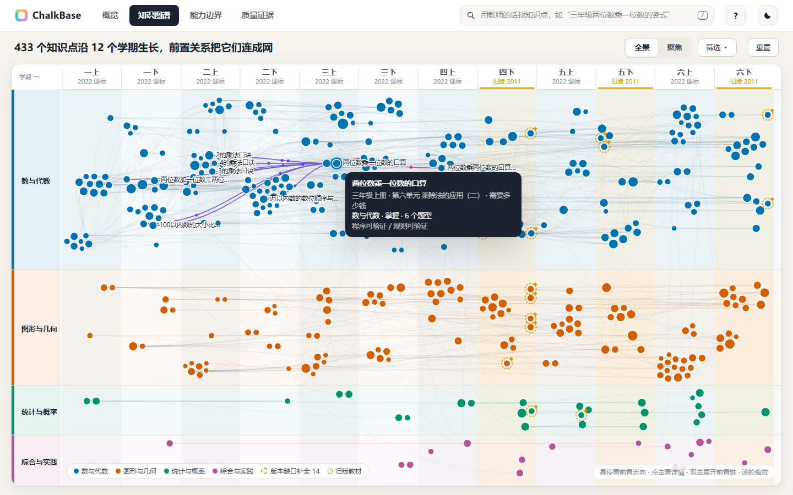
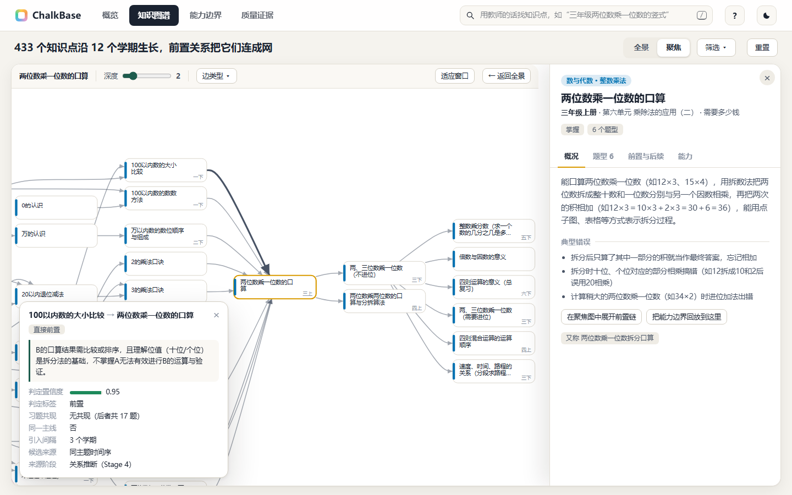
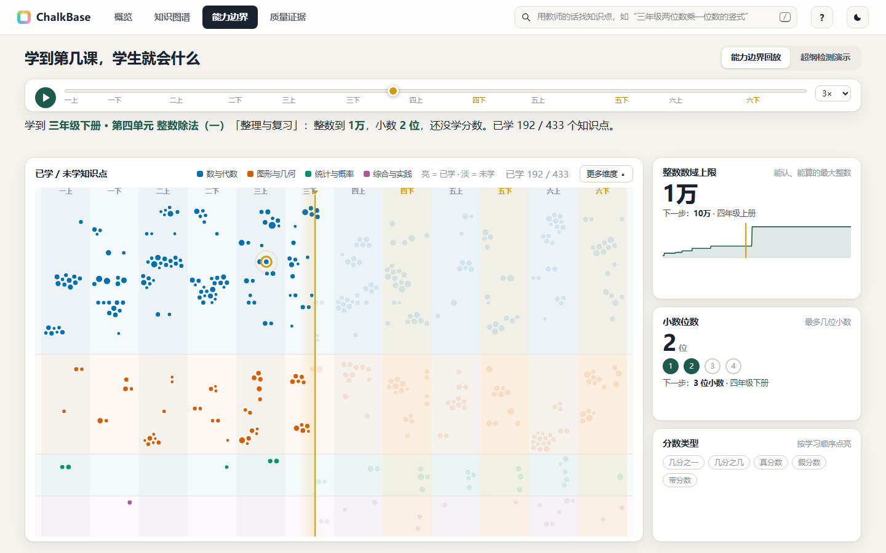
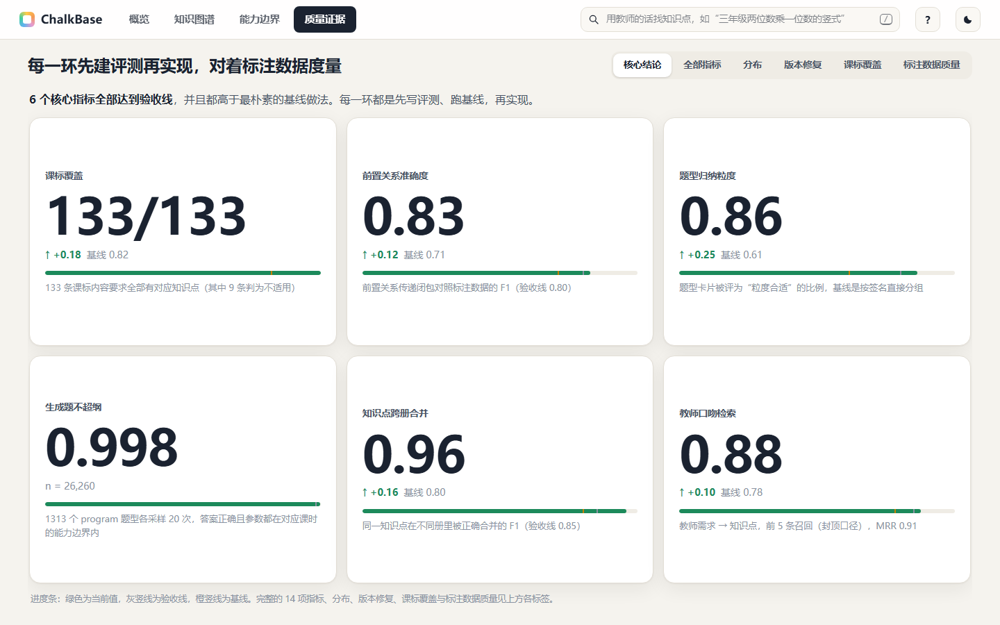
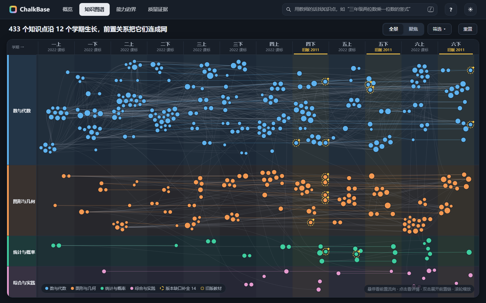

# ChalkBase

**北师大版小学数学（1～6 年级共 12 册）的课程知识库**：知识图谱、题型卡片、能力边界与查询接口，供「可验证命题 Agent」按需检索、出题与校验。

License: [MIT](LICENSE)

## 内容与规模

12 册教材（9 册 2022 课标新版 + 3 册 2011 课标旧版）经抽取、实体消解、题型归纳、关系推断、版本对齐与能力边界推导，得到：

| 内容 | 数量 |
|---|---|
| 教材册数 / 单元 / 课时 | 12 / 130 / 567 |
| 规范知识点（教材 419 + 版本缺口补全 14） | 433 |
| 习题实例（含原文摘录） | 4319 |
| 题型卡片（教材 2009 + 无教材实例的补全题型 59） | 2068（`program` 1313、`rule` 367、`human` 388） |
| 关系边 | 前置 3751（直接 852、隐含 2899）、递进 1851、相关 113、易混淆 2、螺旋扩展 282 |
| 能力边界 | 567 个课时 × 7 个维度 |
| 情境库 / 表述规范 | 43 类 / 214 条 |

每个题型卡片含抽象模板、槽位约束、求解程序、可验证类型、难度（1～5）、典型错误与新写的改写示例；能力边界回答"学完某一课时后，学生会什么、不会什么"，并能判断一道题是否超纲。

## 快速开始

```bash
git clone https://github.com/Scorpioyyy/chalkbase && cd chalkbase
pip install -e .                       # 运行时只依赖 pydantic、numpy；重跑流水线用 pip install -e ".[build]"
```

命令行：

```bash
python -m chalkbase search "四年级小数加减法的拔高题" -k 5
python -m chalkbase kp 乘法分配律
python -m chalkbase chain kp.na.混合运算与运算律.distributive_law --depth 1
python -m chalkbase learned g4a.u3.l01
python -m chalkbase boundary g4a.u3.l01
python -m chalkbase archetypes kp.gg.三角形.angle_sum --examples
python -m chalkbase instantiate at.三角形_angle_sum.01 -n 2 --seed 7 --lesson g4b.u2.l01
```

Python：

```python
from chalkbase import Curriculum

cur = Curriculum()                                   # 加载 data/，约 1 秒

# 1. 按教师口吻检索知识点
for h in cur.search("四年级小数加减法的拔高题", k=3):
    print(h.kp_id, h.name, f"{h.grade}年级")

# 2. 前置链：乘法分配律依赖哪些知识点
kp = cur.find_kp("乘法分配律")[0]
for e in cur.chain(kp.id, direction="prerequisite", depth=1)[:3]:
    print(e.kp_id, e.edge_type)

# 3. 某课时之前学过多少知识点
print(len(cur.learned_before("g2a.u1.l01")))

# 4. 能力边界与越界校验：三年级上册第一课时，两位小数加法是否超纲
rep = cur.check_item({"decimal_places": 2, "operation_forms": {"加法": ["小数"]}}, "g3a.u1.l01")
print(rep.verdict, [(v.dimension, v.item_value) for v in rep.violations])

# 5. 实例化：从题型卡片按种子取参数，渲染题面，程序求解，并在指定课时的边界下校验
for p in cur.instantiate_many("at.三角形_angle_sum.01", 2, seed0=7, lesson_id="g4b.u2.l01"):
    print(p.seed, p.problem, "答案", p.answer, p.verdict)
```

输出：

```
kp.na.混合运算与运算律.decimal_mixed_add_sub 小数加减混合运算 4年级
kp.na.小数加减法.different_places 小数加减法（位数不同） 4年级
kp.na.小数加减法.decimal_add_sub_carry_borrow 小数加减法中的进位与退位 3年级
kp.na.数与运算.natural_number prerequisite
kp.na.整数乘法.2的乘法口诀 prerequisite
kp.na.整数乘法.3的乘法口诀 prerequisite
50
out [('decimal_places', '2'), ('operation_forms', '加法：小数')]
7 在三角形ABC中，已知∠A=92°，∠B=48°，则∠C=______°。 答案 40 in
8 在三角形ABC中，已知∠A=68°，∠B=104°，则∠C=______°。 答案 8 in
```

同一 (题型, 种子) 的实例化结果完全确定；`Problem.verdict` 为 `in` / `borderline` / `out`，`only_in_bounds=True` 时只采边界内的参数。接口细节见 [docs/api.md](docs/api.md)；给调用方 Agent 的精简使用说明见 [chalkbase/AGENT_GUIDE.md](chalkbase/AGENT_GUIDE.md)（`python -m chalkbase guide`）。

## 流水线

每一步只消费上一步冻结的产物，评测先于实现（规格见 `eval/specs/`）。

| 阶段 | 入口 | 产物 | 主要评测指标（test） |
|---|---|---|---|
| 1 抽取观测 | 按 [docs/extraction_guide.md](docs/extraction_guide.md) 逐册抽取 | `work/books/<book>/` | 12 册、4319 实例；结构不变量全部通过 |
| 2 实体消解 | `python -m chalkbase.stage2` | `data/knowledge_points.json`、`kp_local_map.json`、`edges_extends.json` | `same` F1 0.96；扩展误并为同一 0.031；B-cubed F1 0.978 |
| 3 题型归纳 | `python -m chalkbase.stage3` | `data/archetypes.json`、`contexts.json`、`glossary.json` | 粒度"合适"0.863；`program` 生成探针可验证率 1.0；压缩比 2.15 |
| 4 关系推断 | `python -m chalkbase.stage4` | `data/edges_relations.json` | 候选召回 0.981；前置闭包 F1 0.828 |
| 5 版本对齐 | `python -m chalkbase.stage5` | 更新知识点/边/课时；`reports/editions.md` | 自洽违例 0；课标覆盖 100%；缺口审阅通过率 0.982 |
| 6 能力边界 | `python -m chalkbase.boundary enrich → build → apply` | `data/boundaries.json`、知识点 `grants` | 实例不越界 100%；生成探针边界通过率 0.998 |
| 7 查询接口 | `python -m chalkbase …` | — | 检索 recall@5 0.878、MRR 0.910 |
| 8 评测与统计 | `python -m chalkbase.eval --split test`、`python scripts/gen_stats.py` | `reports/eval.md`、`reports/stats.md` | 不变量 148 项全部通过 |

## 质量与评测

- 标注数据由两个不同厂商的模型独立盲标，分歧由更强的模型仲裁，各阶段按 val/test 划分，比例指标附 Wilson 置信区间；每类标注数据的 κ、抽样复核准确率与费用见 [reports/eval.md](reports/eval.md)。
- 每个阶段对照基线：实体消解 `same` F1 0.80 → 0.96；前置闭包 F1 0.71 → 0.83；检索 recall@5 0.78 → 0.88。
- 能力边界的两条探针链路（标准特征 / 题面抽取）、检索探针与生成探针结果见 `reports/eval.md`；已知局限（标注数据一致性偏低、缺口知识点由模型判定而非教材等）见 [eval/known_limitations.md](eval/known_limitations.md)，评测定义的演进见 [eval/CHANGELOG.md](eval/CHANGELOG.md)。
- 统计概览见 [reports/stats.md](reports/stats.md)，版本冲突与缺口补全的明细见 [reports/editions.md](reports/editions.md)。

## 可视化

`viz/index.html` 为单文件，离线双击即可打开：全景图（12 个学期 × 4 个领域泳道）、前置链聚焦图、知识点/题型/能力边界详情面板与评测概览。

| | |
|---|---|
|  |  |
|  |  |
|  |  |

## 仓库结构

```
chalkbase/    数据模型、各阶段算法、查询与实例化接口、CLI、评测入口
data/         规范数据（唯一事实来源）
work/         抽取观测、模型判断记录（Judgment）、各阶段中间产物
eval/         评测规格、标注数据、标注指南、探针、变更记录
reports/      评测与统计报告、版本对齐记录、截图
docs/         设计说明、API 文档、抽取指南、种子主线词表
schema/       导出的 JSON Schema
config/       教学序列、课标清单
scripts/      辅助脚本（统计、Schema 导出、可视化构建）
viz/          可视化
tests/        不变量与接口测试
```

设计决策与量化依据见 [docs/design.md](docs/design.md)，项目规格见 [KICKOFF.md](KICKOFF.md)，工程规则见 [CLAUDE.md](CLAUDE.md)。

## 与下游命题 Agent 的关系

ChalkBase 是 VeriChalk（面向小学数学教师的可验证命题 Agent）的知识底座：意图解析依赖知识点检索，检索与生成依赖题型卡片与情境库，验证闭环依赖能力边界与题型的可验证类型，组卷依赖稳定的知识点 ID 与难度，螺旋复习依赖前置边与引入/复现位置。下游只依赖 `data/` 与 `chalkbase` 接口，不读教材 PDF，也不需要重跑本仓库的流水线。

## 数据与版权

`data/` 是规范数据的唯一事实来源；`work/judgments/` 保存每一次模型判断的输入、结论、置信度与理由，可审计、可重放。`textbook/` 下的教材 PDF 不入库。`data/exercises.json` 含单题粒度的习题原文摘录（教学研究用途）；题型卡片的改写示例均为新写，并非教材原题的复述。

## 环境与密钥

Python ≥ 3.11，开发环境见 `environment.yml`。查询、检索与实例化在离线下可用；只有重跑流水线、重做评测或在线计算新查询向量时才调用阿里云百炼（DashScope），需要环境变量 `DASHSCOPE_API_KEY`（可选 `DASHSCOPE_BASE_URL`）。
